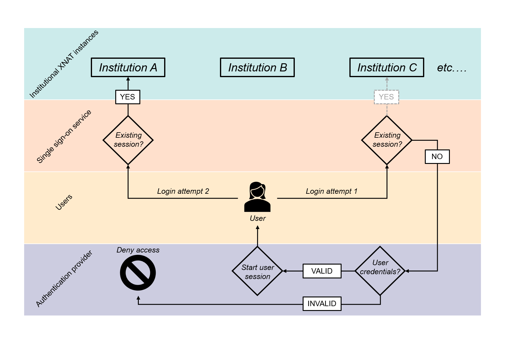

# **AUTHENTICATION STRATEGIES REPORT**

### **Introduction**

##### *XNAT federation*
The XNAT federation we are aiming to create will require some form of authenticating users so that we can control access to the various instances of XNAT at NCITA institutions.  Ideally, and depending on individual XNAT project permissions, a user will be able to access any of the NCITA institution XNAT instances.  Furthermore, the user, once authenticated, should be able to access another XNAT instance without having to be re-authenticated.  The general framework of this process is presented in figure  1.  This general framework requires two main components: some means of checking if the user has been authenticated, and a means by which the user can be authenticated.

**Figure 1.** A framework for the authentication process of the XNAT federation.  Multiple XNAT instances will exist across the various NCITA institutions.  A user should be able to access any of these, and upon attempting to log in, a “single sign-on service” (in the parlance of Shibboleth) checks if the user has been authenticated already (a “session”, again from Shibboleth).  If the answer is no, as in the first login attempt, then the user is redirected to an authentication provider, which requires that the user present their credentials.  Such credentials could be simply a username or password, or include an additional level of authentication.  If the credentials are good, then the user will be allowed to access the institutional XNAT instance.  Later, if the user wishes to login to another XNAT instance (login attempt 2), they will have a valid session, and will not be redirected to the authentication provider, instead, they will be allowed access to that instance right away.

##### *Federated access and single sign-on*
As described, the above framework is both a federated access mechanism and also single sign-on.  The two terms are used in the same place, often, but they do mean different things.  Single sign-on, as the name suggests, is simply a system whereby a user can log in once to gain access to multiple services.  In this case the service provider would ask for the user’s credentials and verify them.  In a federation, credentials are verified not with the service provider, but with a separate entity, general called the identity provider.  So an identity provider will verify the user’s credentials, and the service provider will trust the identity provider; the service provider does not see the user’s credentials.  Typically, the identity provider will be some form of “home” institution relative to the user.  Thus, federation access can provide single sign-on, and this is how the XNAT federation should work.  There exist a number of ways of implementing this type of system; these are considered next.

### **Existing federated access systems**
##### *Eduroam*
Made for the purpose of providing internet connectivity to researchers, students and staff of participating institutions.  User credentials are home institution information, and are not shared with other institutions; the service forwards the user’s details to the home institution, and they are verified there.  Thus, it is very much a federated access system.  Eduroam uses a network of servers run by the institutions and the National Research and Education Networks (NRENS; e.g. Janet) to route access requests back to the home institution.  

Eduroam authentication is based on 802.1X, an IEEE standard for port-based network access control that provides a mechanism for authentication of devices, allowing attachment to a local area network (LAN) or wireless LAN.  It uses a linked hierarchy of RADIUS (Remote Authentication Dial-In User Service) servers which contain users’ data (i.e. at their home institution, the data being usernames and passwords).  In 802.1X, there are three components: the supplicant (a client device), the authenticator (a network device that can link client and network), and an authentication server (which receives and responds to requests for access, and inform the authenticator component whether a request is to be accepted).  In this scheme, the RADIUS part is the link between the authenticator and the authentication server.  

##### *Shibboleth*
For web single sign-on across or within organisational boundaries, using OASIS Security Assertion Markup Language (SAML).  User authentication is based on home organisation credentials, where the home organisation passes the relevant identity information to the service provider.  Thus, again, this is a good example of federated access.

The Shibboleth information describes four entities that appear to be at least superficially similar to those components of 802.1X discussed above.  There is a web browser (i.e. the user/client), a resource (i.e. internet or LAN content), an identity provider (like the authentication server) and a service provider (like the authenticator).  A user will try to access a resource, at which point they are directed to the service provider.  The service provider software will typically be installed on the same server as the resource.  The service provider then issues an authentication request to give to the identity provider; the identity provider then checks the user’s credentials (username and password) and gives a response to the service provider.  The service provider then creates a session for the user, and will also make available some information about the user.  It is possible to have a service provider working with multiple identity providers, and vice versa.  

##### *OAuth*
Generally for internet users to authorise a given website, application, etc. to access their information on other websites without divulging a password.  So, it specifies means by which an owner of a resource can allow third-party access to their resources without sharing credentials.  Note that OAuth is a funny one here; it is intended to be used for authorisation, not authentication per se, but it can, and is, used within authentication frameworks, such as OpenID (see below) and Facebook Connect.

In the language of OAuth, there are four roles: a resource owner, who can grant access to a protected resource, a resource server, which hosts the protected resources and is capable of accepting/responding to resource requests, a client, which is an application making resource requests, and an authorisation server, which issues access tokens to the client, which the client will use to access the resource server.  It delegates access: the client can use the token to access user’s information.

OAuth is not authentication for the reason that the access token that is granted to the client from the authorisation server says nothing about the user.  One of the main points of OAuth, the delegated access, is useful for when the user is not present.  Frameworks built on top of OAuth for authentication will provide the client with some kind of information about the identity and presence of the user.   

##### *OpenID*
As mentioned in the previous section, OpenID (actually, OpenID Connect, but I’ll stick with OpenID) is built on top of OAuth, and is used for authentication, not just authorisation.  In the OpenID way of doing things, there is an additional piece of information, an ID token, which is passed to the client from the authorisation server, as well as the standard OAuth access token.  This additional token is a JSON Web Token (JWT).  

##### *ORCID*
Provides a unique identifier for an individual.  Some sites use ORCID credentials (username and password) for users to sign in to their systems.  It looks as if using ORCID credentials for sign-in uses OAuth; specifically, the “three-legged OAuth authorisation”, so-called because it requires three parties to obtain the access token.  The three legs are the user, the application, and the ORCID OAuth service.  
